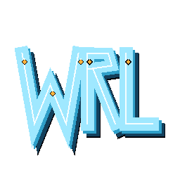

<p align="center">
  
</p>

# WRL Forge

A Linux-first, Windows-supported desktop tool for editing, previewing, inspecting, and packaging classic VRML97 `.wrl` content for Cybertown items and worlds.

**Status:** Public beta · prerelease · unsigned · x64 only
**Platforms:** Linux x64 · Windows x64

**➡️ [Download the latest release](https://github.com/DJAscendance/wrlforge/releases/latest)**

> WRL Forge is an independent community project. It is **not affiliated with, endorsed by, sponsored by, or officially connected to** Cybertown or its current/former operators. "Cybertown" and related names belong to their respective owners.

---

## What WRL Forge Is

WRL Forge is an Electron desktop application for working with classic VRML97 `.wrl` content. It can:

- **Open VRML97 `.wrl` files** — both plain and gzip-compressed, transparently.
- **Edit with a native code editor** (CodeMirror 6): syntax highlighting, an outline, live syntax diagnostics and advisories, line/column tracking, five themes (including High Contrast), and zoom (Ctrl +/-/0). Saves are backup-first, with external-change conflict detection.
- **Preview unsaved edits live** with an embedded X_ITE renderer for both the Mall Item and World Project lanes — a split view of your in-memory buffer, no temporary file, with a 700 ms debounce. It keeps the last-valid scene on screen during a temporary syntax error and recovers when you fix it.
- **Inspect Mall Items** with a Cybertown placement preview: Original mode and Fit mode with placement guides and scale info. Preview transforms never modify your source file.
- **Work with World Projects**: scan a multi-file world (nested Inline files, textures) and get a report of missing, unsafe, or case-mismatched assets; view an embedded X_ITE world preview with a viewpoint selector, navigation modes, and reset view; and edit a nested WRL while previewing it inside the full world.
- **Build a World Project Bundle**: a portable ZIP for manual review and hand-off (uploaded by hand through the Cybertown website), written by a deterministic in-repo ZIP writer.

Rendering is **X_ITE only** — the sole approved renderer.

## What It Is Not

- **No direct Cybertown upload**, no Cybertown authentication, and no automatic submission. These will not be built — it is a locked product decision.
- **No custom renderer** — X_ITE is the only renderer.
- **No official Cybertown affiliation.**
- **No guarantee** that every historical VRML extension behaves identically to the original platform.
- **No telemetry, analytics, ads, auto-update, code signing, or crash upload.**

## Download

Get every artifact from the **[latest release](https://github.com/DJAscendance/wrlforge/releases/latest)**.

| Platform | Recommended | Alternative |
|---|---|---|
| Linux x64 | AppImage | tar.gz |
| Windows x64 | Setup EXE | MSI, portable EXE, ZIP |

**Not sure which to pick?** On Linux, download the **AppImage**. On Windows, download the **Setup EXE**.

Canonical artifact file names:

- Linux x64
  - `WRL-Forge-1.3.0-beta.2-linux-x64.AppImage` (recommended)
  - `WRL-Forge-1.3.0-beta.2-linux-x64.tar.gz` (portable app directory)
- Windows x64
  - `WRL-Forge-Setup-1.3.0-beta.2-x64.exe` (recommended — NSIS installer)
  - `WRL-Forge-1.3.0-beta.2-x64.msi` (MSI installer)
  - `WRL-Forge-Portable-1.3.0-beta.2-x64.exe` (portable, no install)
  - `WRL-Forge-1.3.0-beta.2-windows-x64.zip` (portable unpacked app)
- Checksums: `SHA256SUMS-1.3.0-beta.2.txt`

These are **unsigned beta** builds. See [Known Limitations](#known-limitations) and [docs/INSTALLATION.md](docs/INSTALLATION.md) for install details.

## Quick Start

1. **Install.** Download the recommended artifact for your platform (Linux → AppImage, Windows → Setup EXE) and follow [docs/INSTALLATION.md](docs/INSTALLATION.md).
2. **Open a `.wrl` file.** Plain or gzip-compressed — WRL Forge handles both transparently.
3. **Edit** in the native editor: syntax highlighting, outline, diagnostics, themes, and zoom.
4. **Preview your unsaved changes** in the live split-view X_ITE preview — no need to save first.
5. **Save.** Saves are backup-first and detect external changes to the file.
6. **Open a World Project** — switch to the World Project lane and open a project folder or primary `.wrl` to scan a full multi-file world, preview it, and build a World Project Bundle.
7. **Hit a problem?** [Report it](https://github.com/DJAscendance/wrlforge/issues/new/choose).

For a screenshot-driven walkthrough, see [docs/SCREENSHOTS_AND_USAGE.md](docs/SCREENSHOTS_AND_USAGE.md).

## Features

- **Gzip-transparent editing** — open, edit, and save plain or gzip-compressed `.wrl` files without manual decompression.
- **Native VRML97 editor** — CodeMirror 6 with syntax highlighting, an outline view, live syntax diagnostics and advisories, and line/column display.
- **Five editor themes** including a High Contrast theme, plus persistent zoom (Ctrl +/-/0) that scales both the code and the interface for low-vision accessibility.
- **Backup-first saving** with external-change conflict detection.
- **Live unsaved X_ITE preview** for both Mall Item and World Project lanes — split view of the in-memory buffer, no temp file, 700 ms debounce, last-valid-scene recovery.
- **Mall Item placement preview** — Original and Fit modes with placement guides and scale info; non-destructive (never rewrites your source).
- **World Project scanning** — resolves the full local asset graph (nested Inline WRL at any depth, textures, URL assets) and reports missing, unsafe, absolute/traversal, remote, duplicate, and case-mismatched references, with no arbitrary texture limit.
- **World preview** — embedded X_ITE render of the whole world with a viewpoint selector, navigation modes, and reset view; local-only and asset-graph-authorized.
- **Nested WRL editing with full-world preview** — edit a nested world file and see your unsaved changes inside the complete scene.
- **World Project Bundle** — deterministic portable ZIP for manual review and hand-off, with a machine-readable manifest and human-readable report.
- **Optional external editor** — an explicit external-editor action can launch VSCodium if it is discovered on your system. Ordinary file opening never launches it; VSCodium is optional, not required.

## Screenshots and Full Guide

See the full, screenshot-driven guide: **[docs/SCREENSHOTS_AND_USAGE.md](docs/SCREENSHOTS_AND_USAGE.md)**.

## Known Limitations

- Unsigned Windows builds may trigger **Windows SmartScreen/Defender** warnings on first launch ("More info → Run anyway"). Unsigned by design for this beta.
- The portable EXE has a documented **stdout-handshake QA limitation** (affects automated capture only, not normal use).
- Historical, nonstandard VRML extensions may not behave identically to the original platform.
- Parser **advisories are advisory-only**; the **X_ITE runtime is authoritative** for what actually renders.
- **x64-only** public beta (no ARM64, no macOS).
- **No direct upload** — the World Project Bundle is a manual hand-off.

For install and runtime troubleshooting, see [docs/TROUBLESHOOTING.md](docs/TROUBLESHOOTING.md).

## Reporting Bugs

Please file issues through the **[GitHub issue forms](https://github.com/DJAscendance/wrlforge/issues/new/choose)**. Three structured forms are available:

- **Bug report** — something is broken or behaving incorrectly.
- **Installation or launch problem** — a download won't install or start (SmartScreen, errors, etc.).
- **VRML compatibility report** — a `.wrl` renders or parses differently than expected.

For questions and general help, use [GitHub Discussions](https://github.com/DJAscendance/wrlforge/discussions) or see [SUPPORT.md](SUPPORT.md). Please do not report security vulnerabilities in public issues — see [SECURITY.md](SECURITY.md).

## Development

WRL Forge requires **Node 20+** (built and tested on Node 20.20.2). The only runtime dependency is **`x_ite`** (MIT); everything else (CodeMirror, `@lezer`, esbuild, Electron, electron-builder, `@resvg/resvg-js`) is a dev dependency.

```bash
npm ci                  # install dependencies
npm run build:icons     # generate app icons
npm run build:editor    # bundle the CodeMirror editor (esbuild)
npm test                # non-visual test suite
npm run check           # tests + syntax gate
npm start               # run in development
npm run dist:linux      # build Linux AppImage + tar.gz (run on Linux)
npm run dist:windows    # build Windows NSIS + MSI + portable + ZIP (run on Windows)
```

See [docs/BUILD.md](docs/BUILD.md) for full build and packaging details, and [CHANGELOG.md](CHANGELOG.md) for release history.

## Security

To report a security vulnerability, please use GitHub's private vulnerability reporting (the repository **Security** tab → **Report a vulnerability**). See **[SECURITY.md](SECURITY.md)** for the full policy.

## Credits and Historical Inspiration

WRL Forge is inspired by the builders, coders, and community members who made Cybertown a memorable creative place. With thanks to:

- Morning.star
- scott99 (whose name is Mark)
- LSS
- Wovencroft
- GeordieJohn
- ComTech and the broader coder community

Naming these people reflects gratitude and inspiration only. It implies **no endorsement, employment, ownership, or official Cybertown affiliation**, and this project is not presented as their work.

## Copyright

`Copyright © 2026 Ryan Bundy. All rights reserved.`

WRL Forge is source-available for inspection but is **not** licensed as open source (`package.json` license: `UNLICENSED`). Third-party components retain their own licenses. See [COPYRIGHT.md](COPYRIGHT.md) for details.
