# WRL Forge — Screenshot Walkthrough & Usage Guide

A screenshot-guided tour of everyday tasks in WRL Forge, the Linux-first, Windows-supported desktop tool for classic VRML97 `.wrl` content. Follow along with your own copy and compare against the pictured states.

> These screenshots reflect the current **1.3.0-beta.2** (first public beta) views. WRL Forge is a beta, unsigned prerelease; exact pixels may shift slightly between builds. It is an independent community project and is **not affiliated with, endorsed by, or officially connected to Cybertown** or its current/former operators.

New here? See [INSTALLATION.md](INSTALLATION.md) to get the app, and [TROUBLESHOOTING.md](TROUBLESHOOTING.md) if something looks off. For the project overview, see the [README](../README.md).

---

## 1. Starting WRL Forge

Launch WRL Forge like any desktop app (the AppImage on Linux, or the installed app / portable EXE on Windows). It opens directly into a workspace — no login, no account, no network sign-in.

WRL Forge has **two workspaces (lanes)**:

- **Mall Item lane** — inspect and edit a single `.wrl` item, with a Cybertown placement preview.
- **World Project lane** — work with a multi-file world (a primary `.wrl` plus nested Inline files and textures), with a full-world preview and a bundle builder.

You move between them with the workspace toggle. From the World Project workspace, the **← Mall Item workspace** button returns you to the Mall Item lane (visible in screenshot 09 below); the World lane is reachable the same way from the Mall side.

**Action:** Open the app and note which workspace is showing.
**Expected result:** The app is ready immediately in one of the two lanes. In the Mall Item lane you can open a `.wrl` item into the native editor (see [Section 2](#2-opening-a-mall-item)); the toolbar and status bar are visible and idle (as in screenshot 01).

---

## 2. Opening a Mall Item

Open a single VRML97 item to inspect its structure and validation state. WRL Forge reads both **plain** and **gzip-compressed** `.wrl` files.

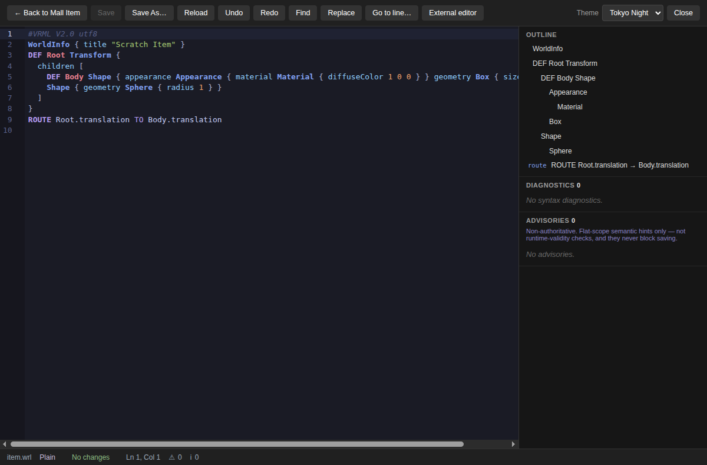

*The native editor on `item.wrl`: Tokyo Night syntax highlighting on the left, the OUTLINE panel (WorldInfo, the DEF Root Transform, the Shape tree, and a ROUTE) on the right, and DIAGNOSTICS 0 / ADVISORIES 0. The toolbar carries Back to Mall Item, Save, Save As…, Reload, Undo, Redo, Find, Replace, Go to line…, External editor, the theme selector, and Close. The status bar reads `item.wrl · Plain · No changes · Ln 1, Col 1`.*

Once open, you can preview how the item sits in a Cybertown placement. The Original view shows the item as authored:

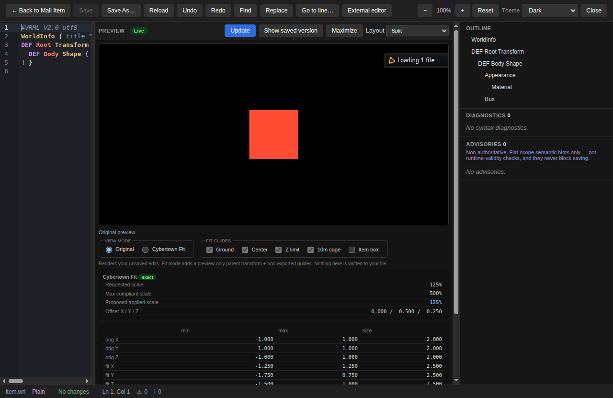

*Split view with the live X_ITE preview in **Original** mode — the item exactly as your file describes it, before any Cybertown fit adjustments.*

**Action:** Open a `.wrl` item in the Mall Item lane.
**Expected result:** The file loads into the editor with syntax highlighting; the OUTLINE panel lists the item's nodes; the status bar shows the file name, whether it is `Plain` or `Gzip`, the change state, and the cursor line/column. DIAGNOSTICS shows the current syntax-validation count (0 for a clean file).

---

## 3. Editing in the Native Editor

The built-in editor (CodeMirror 6) is where ordinary editing happens — no external program is launched to open a file.

*Highlighting, the live OUTLINE, and the `Ln · Col` readout in the status bar keep you oriented as you edit.*

Syntax diagnostics update as you type, and you can jump straight to a flagged spot:

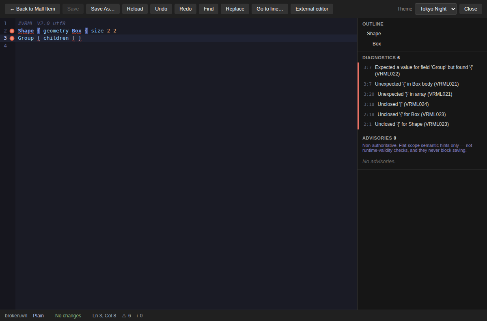

*Diagnostic navigation moves the cursor to a reported syntax issue so you can fix it in place.*

When you change the buffer, the editor marks it dirty and enables Save:

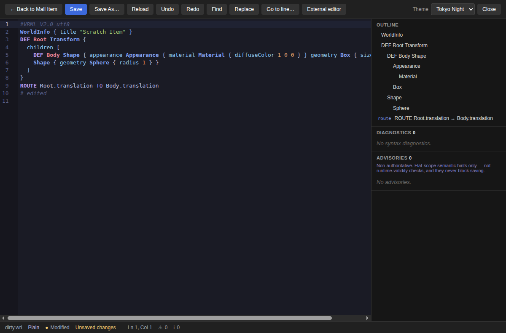

*A modified buffer: the unsaved-changes indicator appears and Save becomes available.*

A few things worth knowing:

- **Plain and gzip** `.wrl` files are both supported; a gzip file is shown as `Gzip` in the status bar and re-saved compressed.
- **Backup-first saves**: WRL Forge writes a backup before overwriting your file.
- **External-change conflict detection**: if the file changes on disk while you are editing, WRL Forge detects the conflict rather than silently clobbering it.
- **VSCodium is optional.** The **External editor** button is a deliberate, separate action (see [Section 10](#10-using-vscodium)). Ordinary opening always uses the built-in editor.

**Action:** Type a change into an open item, then press Save.
**Expected result:** While editing, the buffer is marked modified and Save is enabled; after saving, a backup is written first, the change lands on disk, and the status bar returns to a no-changes state.

---

## 4. Unsaved Live Preview

The live X_ITE preview renders your **in-memory buffer** — your unsaved edits, with no temp file written. Updates are debounced (about 700 ms) so the scene refreshes shortly after you stop typing.

*After an edit, the preview updates to match the buffer (here a cyan sphere). The status shows `Modified · Unsaved changes` — the preview is drawing your unsaved work.*

If an edit temporarily breaks the syntax, the preview does not go blank — it holds the last scene that parsed:

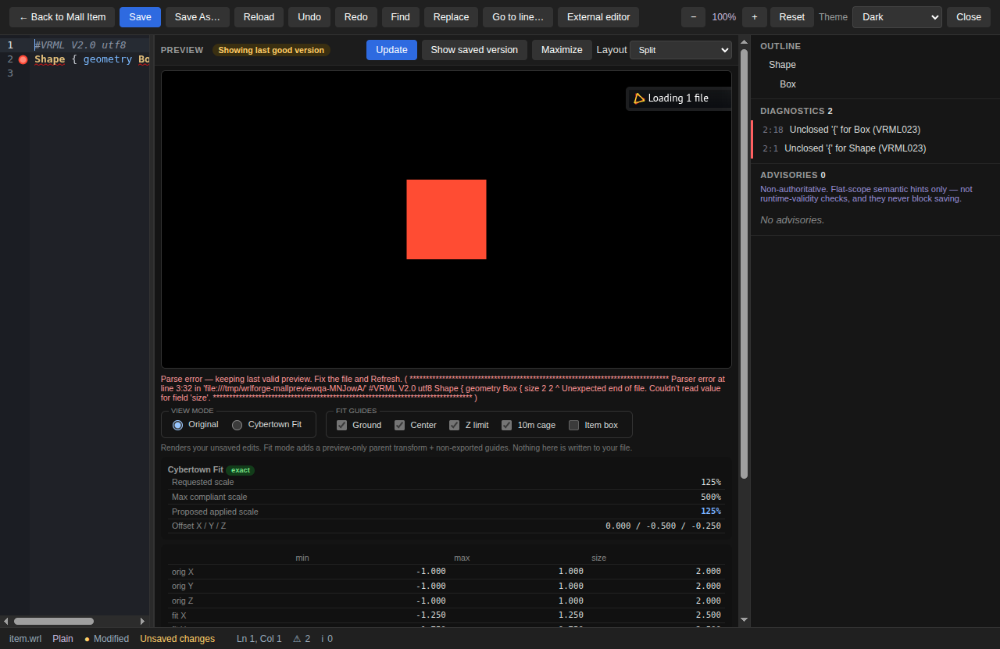

*During a temporary syntax error the preview keeps the **last good version** rather than flashing an error, so you can keep working.*

As soon as the syntax is valid again, the preview returns to live:

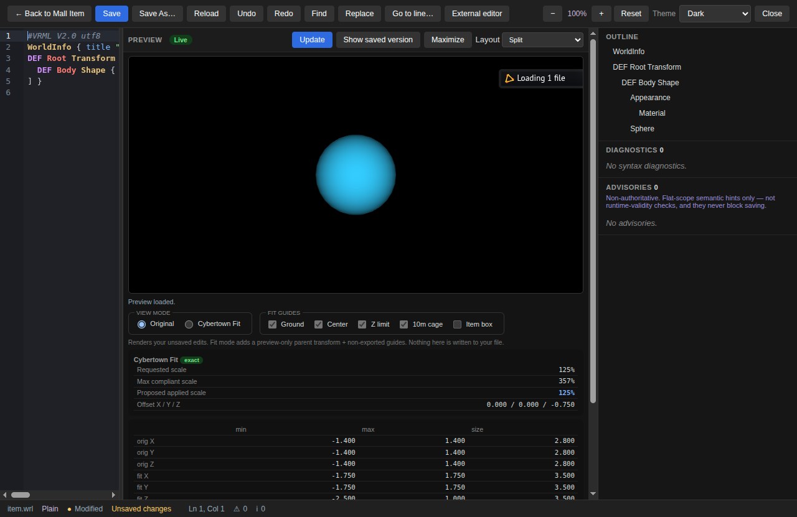

*Once the edit parses cleanly the preview recovers and goes **Live** again.*

**Action:** Edit the buffer with the live preview open; introduce a temporary syntax error, then fix it.
**Expected result:** The preview updates a moment after each valid edit. While the buffer is briefly invalid, it shows the last good version. When the syntax is corrected, it recovers to Live automatically.

---

## 5. Cybertown Fit Preview

The Mall Item preview offers two modes. **Original** shows the item as authored; **Cybertown Fit** overlays placement guides and reports the scale and offset that a Cybertown placement would apply.

*Original mode — no fit adjustments, no guides.*

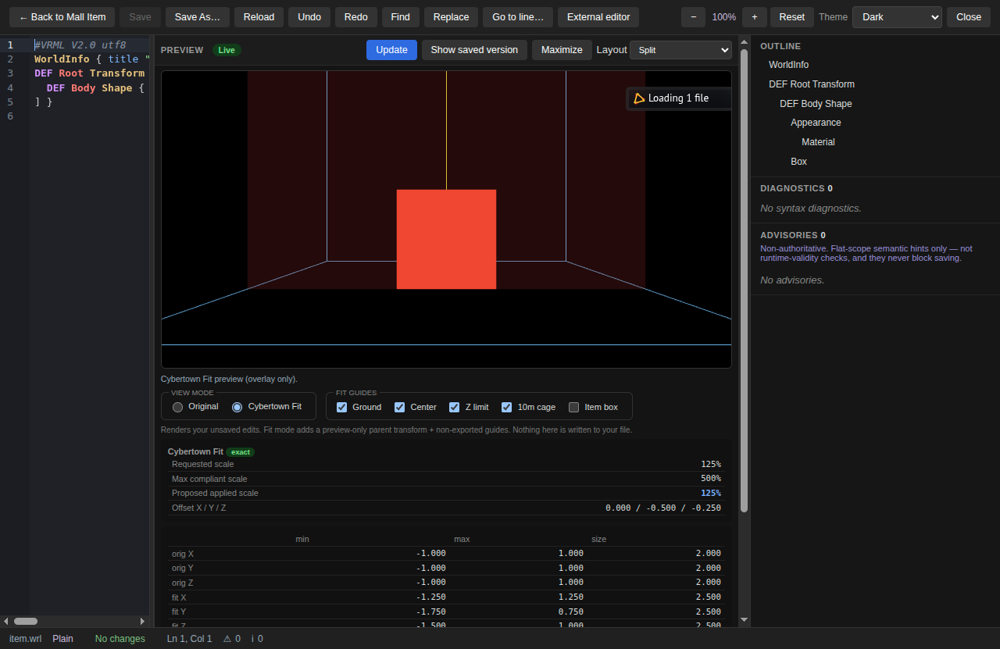

*Cybertown Fit mode adds preview-only **Fit Guides** (Ground, Center, Z limit, the 10 m cage, and the Item box) and a scale table: Requested scale, Max compliant scale, Proposed applied scale, and Offset X/Y/Z. It renders your unsaved edits; the fit guides and any fit scaling are preview-only — nothing is written to your file.*

**Action:** Switch the preview from Original to Cybertown Fit.
**Expected result:** The guides and the fit scale table appear. The reported scale/offset describe how a placement would fit the item — your source `.wrl` is unchanged.

---

## 6. Opening a World Project

The World Project lane works with a multi-file world: a primary `.wrl` plus its nested Inline files and textures.

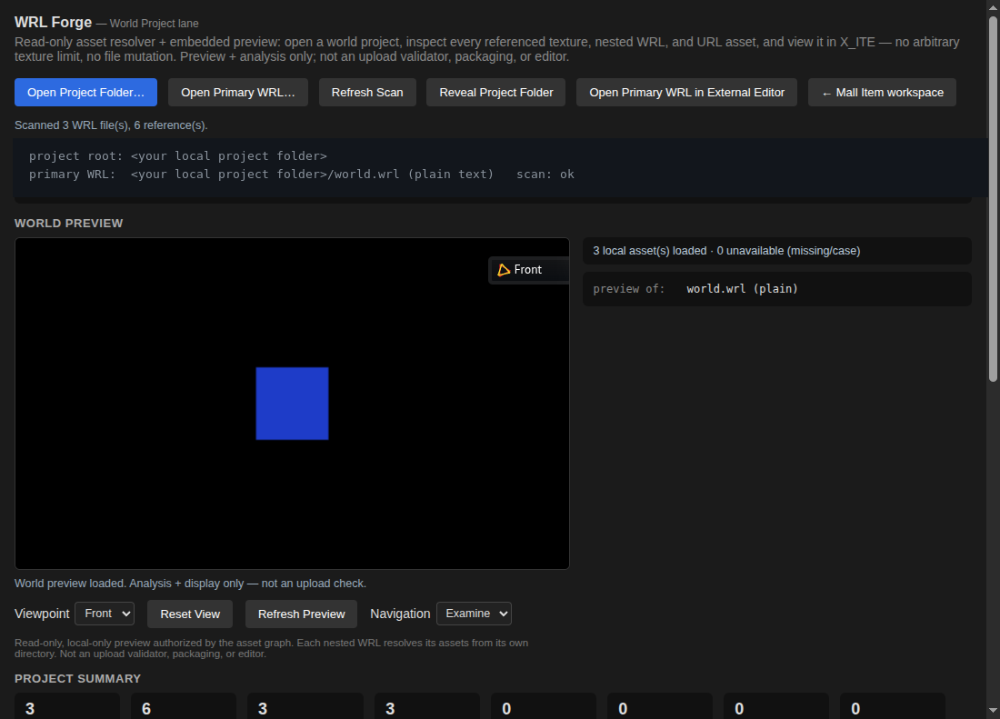

*The World Project workspace. Buttons across the top include Open Project Folder, Open Primary WRL, Refresh Scan, Reveal Project Folder, Open Primary WRL in External Editor, and **← Mall Item workspace**. The scan header shows your local project folder (shown here as a generic `<your local project folder>`). The WORLD PREVIEW pane reports `3 local assets loaded · 0 unavailable (missing/case)`, with a Viewpoint selector, Reset View, Refresh Preview, and Navigation controls, plus a PROJECT SUMMARY of counters.*

The scan follows nested **Inline** files and **textures**, and reports anything it cannot safely load: missing files, case mismatches, remote URLs, and unsafe paths.

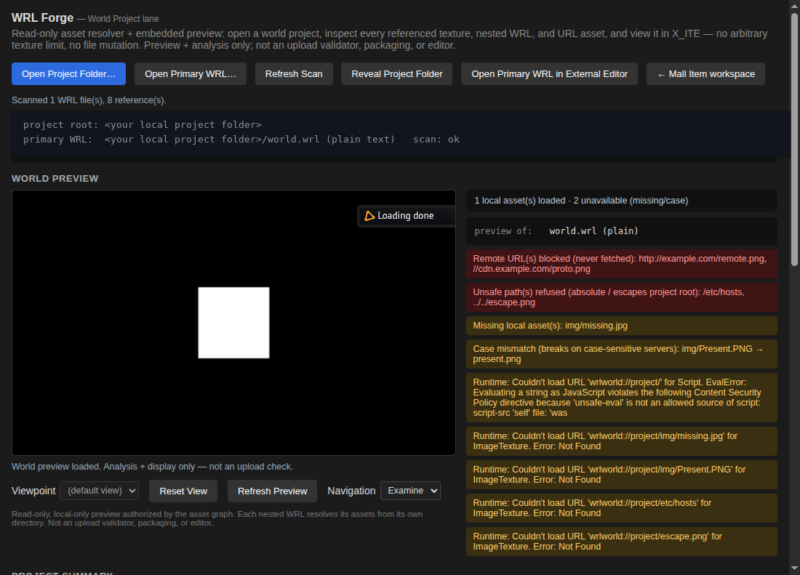

*World diagnostics: `Remote URL(s) blocked (never fetched)`, `Unsafe path(s) refused (absolute / escapes project root)`, `Missing local asset(s): img/missing.jpg`, and `Case mismatch (breaks on case-sensitive servers): img/Present.PNG → present.png`, alongside any runtime load errors. Here the pane reports `1 local asset loaded · 2 unavailable (missing/case)`.*

**Action:** Open a project folder in the World Project lane and let it scan.
**Expected result:** The scan header shows the folder; the preview loads the local assets it can resolve; the summary and diagnostics report exactly how many assets loaded and how many are unavailable, with the reason (missing, case mismatch, remote, or unsafe path). Remote URLs are never fetched, and paths that escape the project root are refused.

---

## 7. Editing a Nested WRL

You can edit a nested world file and see it in the context of the **whole** world. The preview substitutes your unsaved nested edits into the full scene in memory.

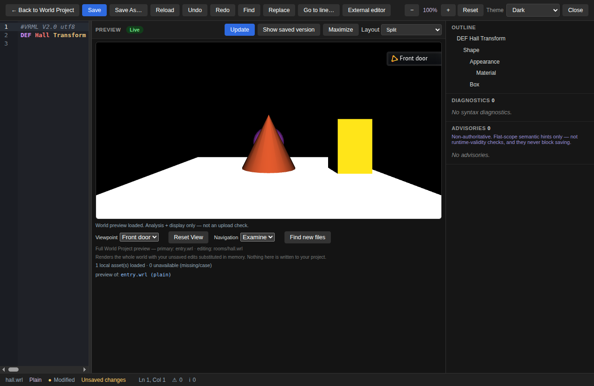

*Editing `rooms/hall.wrl` while the full world renders around it. The header reads `primary: entry.wrl · editing: rooms/hall.wrl`, with the note "Renders the whole world with your unsaved edits substituted in memory. Nothing here is written to your project." The viewpoint is "Front door", Navigation is Examine, and the status reads `hall.wrl · Plain · Modified · Unsaved changes`. Controls include Reset View and Find new files.*

**Action:** Open a nested `.wrl` from a World Project and edit it.
**Expected result:** The full-world preview updates using your unsaved nested edits substituted in memory. Nothing is written to your project. Use **Find new files** to rescan if your edit references a file not yet in the scan.

---

## 8. Viewpoints and Navigation

The world preview lets you jump between the world's defined viewpoints, choose a navigation style, and reset the camera.

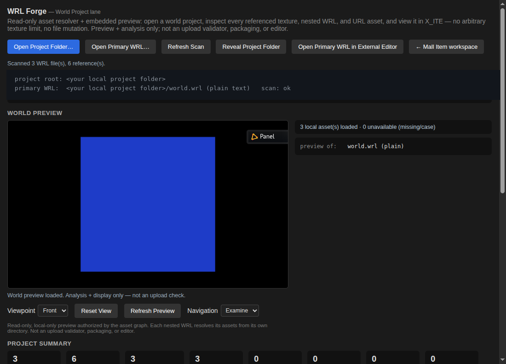

*The Viewpoint selector (e.g. Front / Panel), Navigation set to Examine, and Reset View, driving the world preview.*

**Action:** Pick a viewpoint, choose a navigation mode, then click Reset View.
**Expected result:** The camera jumps to the chosen viewpoint; navigation behaves according to the selected mode; Reset View returns the camera to the current viewpoint's default framing.

---

## 9. Building a World Project Bundle

When a world is ready, WRL Forge can package it into a portable **World Project Bundle** — a ZIP you review and then hand off yourself.

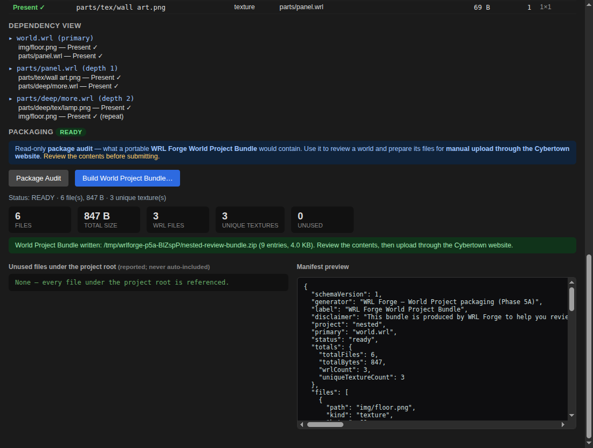

*The packaging view. The DEPENDENCY VIEW tree shows `world.wrl` (primary) → `parts/panel.wrl` → `parts/deep/more.wrl`. The state is PACKAGING READY, with **Package Audit** and **Build World Project Bundle…** buttons. Stats: 6 files, 847 B, 3 WRL files, 3 unique textures, 0 unused. The green banner reads "World Project Bundle written: …/nested-review-bundle.zip (9 entries, 4.0 KB). Review the contents, then upload through the Cybertown website." The manifest preview names the generator "WRL Forge — World Project packaging" and the label "WRL Forge World Project Bundle".*

**Important:** the World Project Bundle is for **manual review and hand-off only**. WRL Forge writes a portable ZIP to a location you choose outside the project; you then review it and **upload it by hand through the Cybertown website**. WRL Forge does **not** upload to any server, does not authenticate to Cybertown, and does not submit anything automatically — those are locked out by design and will not be built.

**Action:** Run Package Audit, then Build World Project Bundle… and choose a destination.
**Expected result:** WRL Forge writes a deterministic ZIP to your chosen destination and shows a success banner with the file name, entry count, and size. Your source project is never modified, copied over, or uploaded.

---

## 10. Using VSCodium

*(Text only — no screenshot.)*

WRL Forge can hand a file to **VSCodium** if you have it, but only when you ask. The **External editor** button (visible in the editor toolbar in screenshot 01, and as "Open Primary WRL in External Editor" in the World lane) is the single, explicit action that launches it.

- Ordinary file opening **never** launches VSCodium — it uses the built-in editor.
- VSCodium is **optional** and is auto-discovered across platforms; if it is not installed, WRL Forge simply reports that it could not find an external editor.
- WRL Forge does not require, bundle, or install VSCodium.

**Action:** Click External editor with VSCodium installed.
**Expected result:** The current file opens in VSCodium. Without VSCodium (or another discoverable editor), you get a clear "not found" message and nothing else changes.

---

## 11. Troubleshooting

A few things you may see, and what they mean. For the full guide, see [TROUBLESHOOTING.md](TROUBLESHOOTING.md).

*Asset diagnostics tell you exactly why something did not load.*

- **Missing local asset** (e.g. `img/missing.jpg`) — the referenced file is not in the project; add it or fix the path.
- **Case mismatch** (e.g. `img/Present.PNG → present.png`) — the reference works on your machine but **breaks on case-sensitive servers**; match the case exactly.
- **Remote URL blocked (never fetched)** — WRL Forge never reaches out to the network for assets; use local files.
- **Unsafe path refused** — absolute paths or paths that escape the project root are refused for safety.

*A temporary parse error keeps the last good scene instead of blanking out.*

- **A parse error keeps the last good scene** — the preview holds the last valid render until your syntax is correct again; this is expected, not a crash.
- **Windows SmartScreen / Defender warning** — the beta is **unsigned by design**, so Windows may warn. Choose "More info → Run anyway". (See [TROUBLESHOOTING.md](TROUBLESHOOTING.md) and [INSTALLATION.md](INSTALLATION.md).)
- **Render vs. advisory authority** — parser **advisories are advisory-only**. The **X_ITE runtime is authoritative** for what actually renders; if a scene renders fine but shows an advisory, trust what X_ITE draws.

---

## 12. Expected Results Checklist

Compare your own run against this compact list:

- [ ] The app launches into a workspace with no login or network sign-in.
- [ ] You can switch between the Mall Item lane and the World Project lane (`← Mall Item workspace` and its counterpart).
- [ ] A `.wrl` item opens with syntax highlighting, an OUTLINE tree, and a `name · Plain/Gzip · change-state · Ln, Col` status bar.
- [ ] Both plain and gzip `.wrl` files open and save.
- [ ] Editing marks the buffer modified and enables Save; saving writes a backup first.
- [ ] The live preview renders your unsaved buffer and updates shortly after each valid edit.
- [ ] A temporary syntax error keeps the last good scene; correcting it recovers to Live.
- [ ] Cybertown Fit mode adds preview-only guides and a scale table without changing your file.
- [ ] A World Project scan reports local assets loaded vs. unavailable, and flags missing / case-mismatch / remote / unsafe references.
- [ ] Editing a nested WRL updates the full-world preview via the unsaved nested override, writing nothing.
- [ ] Viewpoint, navigation mode, and Reset View drive the world preview.
- [ ] Build World Project Bundle… writes a portable ZIP to a destination you choose, for manual hand-off — never a direct upload.

---

## Accessibility

WRL Forge ships accessibility accommodations in the editor.

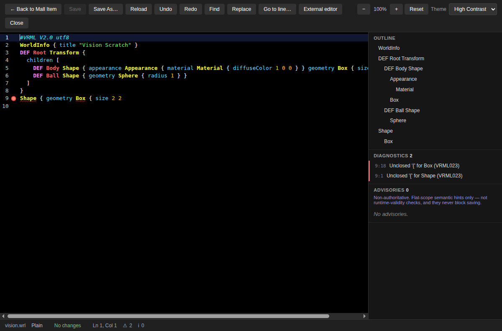

*The editor in the **High Contrast** theme, with the zoom controls (−, 100%, +, Reset) and DIAGNOSTICS reporting 2 issues (including VRML023 "Unclosed '{'") on `vision.wrl`.*

- **Five themes**, including **High Contrast**, selectable from the theme selector.
- **Zoom** with `Ctrl` `+` / `Ctrl` `-` / `Ctrl` `0` (reset), persisted between sessions.

---

Copyright © 2026 Ryan Bundy. All rights reserved. See [COPYRIGHT.md](../COPYRIGHT.md).
